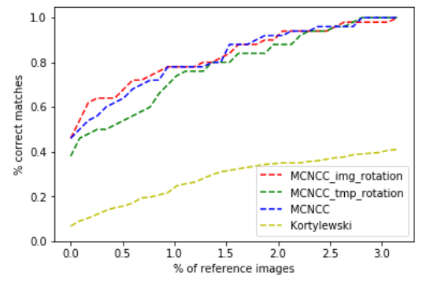

# MCNCC

Shoeprint matching algorithm using multiple feature channels from a pretrained neural network (googlenet) and normalized cross correlation

Steps:

- download the FID-300 dataset and create a new project folder containing the python file and the "datasets" folder
Link to the FID-300 dataset: https://fid.dmi.unibas.ch/


     
- (optionally) If you don't want to run through the whole dataset (depending on your gpu, this can take a long time), you can create two additonal folders with subsets or download the subsets from this repository (*tracks_cropped_Subset* and *Subset* in datasets/FID-300) in the datasets/FID-300 folder. For example the first 50 track images and the corresponding reference images.

- create a virtual environment for this project and install all the necessary packages.
What you need to istall: 

     + torch (go to https://pytorch.org/ and follow the guide)
     + tqdm 
     + matplotlib

- run the program with the string arguments for the tracks folder and the references folder for example: 
```
     python3 mcncc.py tracks_cropped references
```
- after running the program, a .npy file is created storing the correlation matrix (rows: number of tracks in the chosen track folder, columns: number of reference images in the chosen reference image folder)

- use the cmc function in order to create cmc-plots from your correlation score-files
```
     cmc_scores = cmc(correlation_matrix)
```
This function creates for example following graph:



- If you don't have access to a GPU you can also use google collaboratory through this link in order to test out the algorithm:
https://drive.google.com/drive/folders/13txeoZfnQ6rAHktlV3-q9x69nJ-rg8qt?usp=sharing


