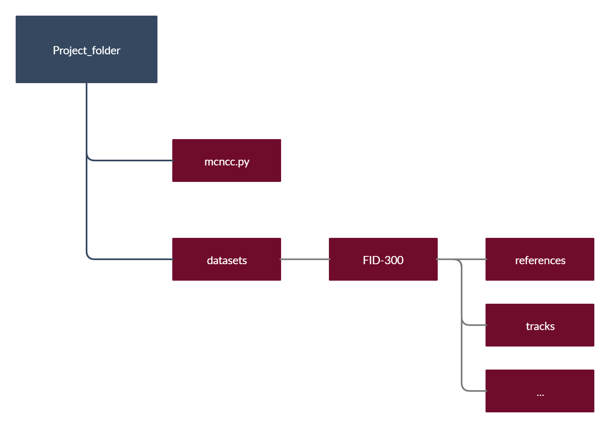
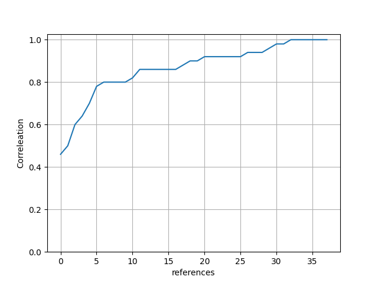
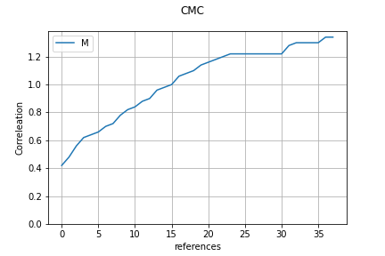
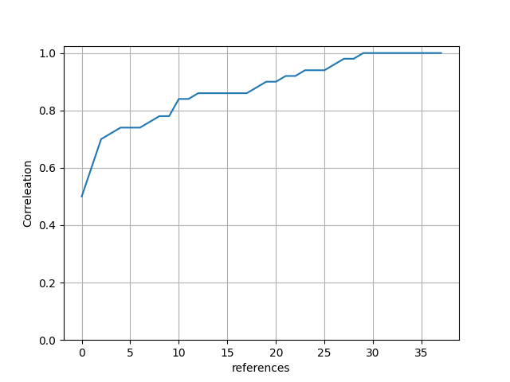

# MCNCC

Shoeprint matching algorithm using multiple feature channels from a pretrained neural network (googlenet) and normalized cross correlation

Steps:

- download the FID-300 dataset and create a new project folder containing the python file and the "datasets" folder
Link to the FID-300 dataset: https://fid.dmi.unibas.ch/


     
- (optionally) If you don't want to run through the whole dataset (depending on your gpu, this can take a long time), you can create two additonal folders with subsets or download the subsets from this repository (*tracks_cropped_Subset* and *Subset* in datasets/FID-300) in the datasets/FID-300 folder. For example the first 50 track images and the corresponding reference images.

- create a virtual environment for this project and install all the necessary packages.
What you need to install: 

     + torch (go to https://pytorch.org/ and follow the guide)
     + tqdm 
     + matplotlib
     + pandas

- run the program with the following arguments: 

optional arguments:

  -h, --help  *(show this help message and exit)*
  
  -t TRACKS, --tracks TRACKS  *(define track folder)*
  
  -rf REFS, --refs REFS  *(define reference folder)*
  
  -str STRIDE, --stride STRIDE     *(stride for convolutions)*
                        
  -r, --rot    *(add rotation)*
  
  -ris START, --start START   *(rotation interval start)*
                        
  -rie END, --end END   *(rotation interval end)*
  
  -sf SCOREFILE, --scorefile SCOREFILE  *(scorefilename)*
  
  -cmc, --cmc  *(calculate cmc)*
  
  -cmcf CMC_FILE, --cmc_file CMC_FILE   *(cmc filename)*
                        
for example
```
     python3 mcncc.py -t tracks_cropped -rf references
```
- after running the program, a .npy file is created storing the correlation matrix (rows: number of tracks in the chosen track folder, columns: number of reference images in the chosen reference image folder)

- use the cmc argument in order to create cmc-plots from your correlation score-files

This function creates for example following graphs:
```
     python drive/My\ Drive/MCNCC/mcncc.py -cmc 
```
    
```
     python drive/My\ Drive/MCNCC/mcncc.py -str 4 -cmc
```

     
```
     python drive/My\ Drive/MCNCC/mcncc.py -cmc -avgp
```

     
- If you don't have access to a GPU you can also use google collaboratory through this link in order to test out the algorithm:
https://drive.google.com/drive/folders/13txeoZfnQ6rAHktlV3-q9x69nJ-rg8qt?usp=sharing


